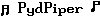

# pydPiper 
A python program written for the Raspberry Pi that controls small LCD and OLED screens for music distributions like Volumio, MoodeAudio, and Max2Play.


## Features
  * Supports multiple music distributions including Volumio (v1 and v2), MoodeAudio, and Max2Play
	* Runs inside a Docker container to increase stability.  This decouples pydPiper from the distribution you run it on.
  * Screens are fully user definable
  * Supports a rich set of system and environmental variables including local weather
  * Compatible with the Winstar WEH and WEG OLED displays
  * Compatible with HD44780 style LCD displays (both I2C and Parallel interface)
	* Compatible with SSD1306 style displays (I2C only)
  * Fully graphics based in its backend allowing any arbritrary font, character set, or image to be displayed if the hardware supports it.
	* For LCD character based displays will dynamically generate custom characters to support characters missing from the font table.  This feature can also be used to display some graphical content on character-based displays though this is limited by the small amount of memory available for customer characters on HD44780 based displays.
  * NEW! A configure function is not included to allow pydPiper to easily be set up for different displays and music distributions

## Display configuration

pydPiper now has standard page files for the displays that it supports.  If the standard display configurations do not meet your needs, you can create your own.  You will need to understand how the pages file system works to accomplish this.

pydPiper displays are configured based upon three key concepts.  The first concept is the widget.  Widgets are used to draw a particular type of content on onto the screen.  There are widgets for displaying text, drawing lines and rectangles, displaying images, or showing a progress bar.  The next concept is the  canvas.  Canvases are collections of widgets where each widget is placed at a particular place within the canvas.  You will typically create a set of canvases that are the same size as your display with each canvas dedicated to a particular display purpose (e.g. show artist, display time).  The last concept is sequences.  A sequence is an ordered list of canvases that are displayed in turn when the sequence is activated.  There should be a sequence for each mode that the music player uses (e.g. play, stop).  Sequences are controlled through conditional expressions which are boolean logic statements.  If the statement evaluates to True, the sequence is activated.  If it is false, the sequence remains dormant.  In addition, each canvas within a sequence can also have a conditional statement to control whether the canvas gets displayed when its turn within the sequence occurs.  Here is a short example.

```
FONTS = {
	'normal': { 'default':True, 'file':'latin1_5x8_fixed.fnt','size':(5,8) },
}

WIDGETS = {
	'artist': { 'type':'text', 'format':'{0}', 'variables':['artist'], 'font':'normal' },
	'title': { 'type':'text', 'format':'{0}', 'variables':['title'], 'font':'normal' },
  'time': { 'type':'text', 'format:Time\n{0}', 'variables':['utc|timezone+US/Eastern|strftime+%-I:%M'], 'just':'center', 'size':(80,16) }
 }

CANVASES = {
	'playingsong': { 'widgets': [ ('artist',0,0), ('title',0,8) ], 'size':(80,16) },
}

SEQUENCES = [
	{
		'name': 'seqPlay',
		'canvases': [ { 'name':'playingsong', 'duration':15 } ],
		'conditional': "db['state']=='play'"
	},
	{
		'name': 'seqStop',
		'canvases': [ { 'name':'time', 'duration':9999 } ],
		'conditional': "db['state']=='stop'"
  }
]
```

This simple example will display the artist on the top line and the title on the bottom line of the display if the system is playing a song.  If the player is stopped, it will display the current time centered on the display.  Full documentation for configuring the display will be found in docs/display.md once I've written it.

Standard display configurations are available

| page file           | Appropriate for       |
| ------------------- | --------------------- |
| pages_weh_80x16.py  | Winstar WEH displays  |
| pages_weg_100x16.py | Winstar WEG displays  |
| pages_lcd_16x2.py   | HD44780 16x2 displays |
| pages_lcd_20x4.py   | HD44780 20x4 displays |

## Installation Instructions

These instructions provide a general description of what you need to do in order to get pydPiper up and running on your system.  Instructions specific to individual music distributions will eventually be provided in the docs directory.

#### Step 1.  Download pydPiper to your system
Log in to your system and issue the following commands to download the software and place it within your home directory.  If you prefer to place it somewhere else, modify the location you untar it from accordingly.

```
sudo wget https://github.com/dhrone/pydPiper/archive/v0.3-alpha.tar.gz
sudo tar zxvf v0.3-alpha.tar.gz
cd pydPiper-0.3-alpha
```

#### Step 2.  Edit the pydpiper.service file
A systemctl services file has been provided with examples for several different popular configurations.  You will need to enable the appropriate ExecStart line for your particular configuration.  You do this by removing the '#' character at the start of the line for the ExecStart that is appropriate.  It is possible that you will also need to edit some of the values for the ExecStart command if your configuration is different than what was provided.

IMPORTANT:  There must be one and only one ExecStart enabled within the file.

The general format for the ExecStart lines is as follows:


`ExecStart=/usr/bin/docker run --network=host --privileged -v /var/log:/var/log:rw dhrone/pydpiper:latest python /app/pydPiper.py --<musicdistro> --driver <driver> --width <width> --height <height> --i2caddress <i2caddress> --i2cport <i2cport> --rs <rs> --e <e> --d4 <d4> --d5 <d5> --d6 <d6> --d7 <d7> --timezone <timezone> --temperature <temperature> --lmsplayer <lmsplayer> --pages <pagefile>`

Definitions for command line Parameters

`<driver>` -- Driver for your display.  Possible values are 'winstar_weg', 'hd44780', 'hd44780_i2c', 'ssd1306_i2c'

`<musicdistro>` -- Sets the type of music player pydPiper is installed on.  Possible values are 'volumio', 'rune', 'lms'

`<width>` -- width of your display in pixels.  If you are using a character display, each column is 5 pixels wide
`<height>` -- height of your display in pixels.  If you are using a character display, each line is 8 pixels high

For I2C displays
`<i2caddress>` -- The I2C address your display is installed on.  Normally 0x27.
`<i2cport>` -- The I2C port your display is attached to.  Normally 1.

For parallel interface displays
`<e>, <rs>, <d4>, <d5>, <d6>, <d7>` -- The GPIO pins your display is connected to

timezone -- Sets what timezone is local for this system (e.g. 'US/Eastern', 'France/Paris')
temperature -- Sets whether to use fahrenheit or celsius

If using a logitech media server player
lmsplayer -- The MAC address for the player.  Should be the localhost's MAC address if running Squeezeplayer on the same system as pydPiper.  Example: 'b8:27:eb:f9:88:1e'

If using Weather Underground services
wapi -- weather underground API key.  Go to https://www.wunderground.com/weather/api/ to request a key.
wlocale -- location to pull weather for.  General format is Zipcode, State/City, Country/City, or Latitude,Longitude (e.g. '20001', 'CA/San_Francisco', 'France/Paris', '37.77,-122.39').

Page files have been created for
  HD44780 style LCDs (16x2 and 20x4 dimensions) -- pages_lcd_16x2.py, pages_lcd_20x4.py
  Winstar WEH style OLEDs (16x2 dimensions) -- pages_weh_80x16.py
  Winstar WEG style OLEDS (100x16 pixel dimensions) -- pages_weg_100x16.py
  SSD1306 style OLEDs (128x64 pixel dimensions) -- pages_ssd1306.py

<pagefile> -- The name of the pages file to use for your display

Once you have finished editing the file, save it and exit.

##### Step 2a.  Weather Data

If you want to have weather data displayed on your system, you will need to request an API key from the Weather Underground service.  This service is free for light usage and under normal conditions pydPiper will not exceed the license.  Note: even if it did the only negative reprecussion would be that pydPiper would not be able to display the current weather.

Go to https://www.wunderground.com/weather/api/ to request a get and then include it on the ExecStart command using --wapi <API Key>.  You will also need to set --wlocale to your location (e.g. --wlocale 'TX/Dallas', --wlocale 'UK/London').

#### Step 3.  Run the install script

There is a provided install script (install.sh) which will finish the installation and start up pydPiper assuming there are no problems.  It is a basic shell script with no error correct and has only been tested on Volumio v2 so far.

```
sudo ./install.sh
```
It will install the Docker engine onto your system, pull down the latest pydPiper docker image, and then configure systemd to enable pydPiper on system start.


## History

Version 0.3 (Alpha). Moved pydPiper into a docker container.  Added support for HD44780 I2C displays and SSD1306 displays.
Version 0.251 (Alpha). Fixed Unicode bug in LMS driver.
Version 0.25 (Alpha). Added support for HD44780 style LCD displays.
Version 0.21 (Alpha). Minor bug fixes.
Version 0.2 (Alpha).  Initial testing release.


## Credits

This software was inspired by the work I had previously done on Raspdac-Display.  The basis for most of that code came from Lardconcepts (https://gist.github.com/lardconcepts/4947360).
A great overview of LCD/OLED logic is available on Wikipedia (https://en.wikipedia.org/wiki/Hitachi_HD44780_LCD_controller).  While that document is focused on the popular HD44870 LCDs, most of what is describe there applies to the Winstar OLED.  There are important differences though.  The OLED appears to be much more sensitive to timing issues and requires a different command sequence to reset it back to a known good state upon a warmstart.
Understanding the initialization behavior of the Winstar in 4 bit mode was greatly assisted by PicAxe who currently have a PDF posted which detailed a method to resync with the display.  This is described on the last page of  http://www.picaxe.com/docs/oled.pdf.
Creating a font system to work on a small pixel display was a challenge.  The file format of my fonts was derived from BMFONT by Angelcode (http://www.angelcode.com).  Finding good examples of low bitcount fonts was hard.  A site dedicated to supporting the Dwarf Fortress game  (http://dwarffortresswiki.org/index.php/Main_Page) was invaluable.  It contains many user contributed sprite tables include many different fonts.  The characters for BigFont_10x16 though came from WoodUino (http://woodsgood.ca/projects/2015/02/17/big-font-lcd-characters/).  This is a very clever font that allows a complete 96 character font to be created that is 16 pixels high while using just the 8 custom characters available on an HD44780 display.  A few symbols (repeat, repeat once, random) where inspired by the LCD program of Randy Cupic (https://github.com/RandyCupic/RuneAudioLCD).

## License

The MIT License (MIT)

Copyright (c) [2015] [Dhrone]

Permission is hereby granted, free of charge, to any person obtaining a copy
of this software and associated documentation files (the "Software"), to deal
in the Software without restriction, including without limitation the rights
to use, copy, modify, merge, publish, distribute, sublicense, and/or sell
copies of the Software, and to permit persons to whom the Software is
furnished to do so, subject to the following conditions:

The above copyright notice and this permission notice shall be included in all
copies or substantial portions of the Software.

THE SOFTWARE IS PROVIDED "AS IS", WITHOUT WARRANTY OF ANY KIND, EXPRESS OR
IMPLIED, INCLUDING BUT NOT LIMITED TO THE WARRANTIES OF MERCHANTABILITY,
FITNESS FOR A PARTICULAR PURPOSE AND NONINFRINGEMENT. IN NO EVENT SHALL THE
AUTHORS OR COPYRIGHT HOLDERS BE LIABLE FOR ANY CLAIM, DAMAGES OR OTHER
LIABILITY, WHETHER IN AN ACTION OF CONTRACT, TORT OR OTHERWISE, ARISING FROM,
OUT OF OR IN CONNECTION WITH THE SOFTWARE OR THE USE OR OTHER DEALINGS IN THE
SOFTWARE.
