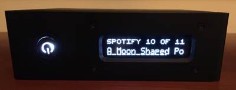
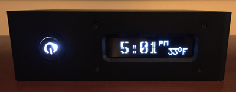

# pydPiper 
A python program written for the Raspberry Pi that controls small LCD and OLED screens for music distributions like Volumio, RuneAudio, and Max2Play.
  

## Features
  * Supports multiple music distributions including Volumio (v1 and v2), RuneAudio, MoodeAudio, and Max2Play.
  * Screens are fully user definable
  * Supports a rich set of system and environmental variables including local weather
  * Compatible with many OLED and LCD displays including
    * HD44780 LCDs
    * Winstar WEH character based displays
    * Winstar WEG graphical displays
  * Fully graphics based in its backend allowing any arbritrary font, character set, or image to be displayed if the hardware supports it.
  * For LCD character based displays leverages dynamically generated custom characters to support characters missing from the font table.  This feature can also be used to display some graphical content on character-based displays though this is limited by the small amount of memory available for customer characters on HD44780 based displays.

## Display configuration

pydPiper displays are configured based upon three key concepts.  The first concept is widget.  Widgets are used to draw a particular type of content on onto the screen.  There are widgets for displaying text, drawing lines and rectangles, displaying images, or showing a progress bar.  The next concept is canvas.  Canvases are collections of widgets where each widget is placed at a particular place within the canvas.  You will typically create a set of canvases that are the same size as your display with each canvas dedicated to a particular display purpose (e.g. show artist, display time).  The last concept is sequences.  A sequence is an ordered list of canvases that are displayed in turn when the sequence is activated.  There should be a sequence for each mode that the music player uses (e.g. play, stop).  Sequences are controlled through conditional expressions which are boolean logic statements.  If the statement evaluates to True, the sequence is activated.  If it is false, the sequence remains dormant.  In addition, each canvas within a sequence can also have a conditional statement to control whether the canvas gets displayed when its turn within the sequence occurs.  Here is a short example.

FONTS = {
	'normal': { 'default':True, 'file':'latin1_5x8_fixed.fnt','size':(5,8) },
}

WIDGETS = {
	'artist': { 'type':'text', 'format':'{0}', 'variables':['artist'], 'font':'normal' },
	'title': { 'type':'text', 'format':'{0}', 'variables':['title'], 'font':'normal' },
  'time': { 'type':'text', 'format:Time\n{0}', 'variables':['utc|timezone+US/Eastern|strftime+%-I:%M'], 'just':'center', 'size':(80,16) }
 }
 
CANVASES = {
	'playingsong': { 'widgets': [ ('artist',0,0), ('title',0,8) ], 'size':(80,16) },
}

SEQUENCES = [
	{
		'name': 'seqPlay',
		'canvases': [ { 'name':'playingsong', 'duration':15 } ],
		'conditional': "db['state']=='play'"
	},
	{
		'name': 'seqStop',
		'canvases': [ { 'name':'time', 'duration':9999 } ],
		'conditional': "db['state']=='stop'"
  }
]

This simple example will display the artist on the top line and the title on the bottom line of the display if the system is playing a song.  If the player is stopped, it will display the current time centered on the display.  Full documentation for configurating the display will be found in docs/display.md once I've written it.  In the mean time, to get you started there are two example configurations provided.  Use pages_fixed.py for LCD and Winstar WEH OLEDs or pages_g.py for Winstar WEG displays.

## Installation Instructions

TBD

## History

Version 0.2 (Alpha).  Initial testing release.

## Credits

The basis for most of this code comes from Lardconcepts (https://gist.github.com/lardconcepts/4947360)
A great overview of LCD/OLED logic is available on Wikipedia (https://en.wikipedia.org/wiki/Hitachi_HD44780_LCD_controller).  While that document is focused on the popular HD44870 LCDs, most of what is describe there applies to the Winstar OLED.  There are important differences though.  The OLED appears to be much more sensitive to timing issues and requires a different command sequence to reset it back to a known good state upon a warmstart.
Understanding the initialization behavior of the Winstar in 4 bit mode was greatly assisted by PicAxe who currently have a PDF posted which detailed a method to resync with the display.  This is described on the last page of  http://www.picaxe.com/docs/oled.pdf.

## License

The MIT License (MIT)

Copyright (c) [2015] [Dhrone]

Permission is hereby granted, free of charge, to any person obtaining a copy
of this software and associated documentation files (the "Software"), to deal
in the Software without restriction, including without limitation the rights
to use, copy, modify, merge, publish, distribute, sublicense, and/or sell
copies of the Software, and to permit persons to whom the Software is
furnished to do so, subject to the following conditions:

The above copyright notice and this permission notice shall be included in all
copies or substantial portions of the Software.

THE SOFTWARE IS PROVIDED "AS IS", WITHOUT WARRANTY OF ANY KIND, EXPRESS OR
IMPLIED, INCLUDING BUT NOT LIMITED TO THE WARRANTIES OF MERCHANTABILITY,
FITNESS FOR A PARTICULAR PURPOSE AND NONINFRINGEMENT. IN NO EVENT SHALL THE
AUTHORS OR COPYRIGHT HOLDERS BE LIABLE FOR ANY CLAIM, DAMAGES OR OTHER
LIABILITY, WHETHER IN AN ACTION OF CONTRACT, TORT OR OTHERWISE, ARISING FROM,
OUT OF OR IN CONNECTION WITH THE SOFTWARE OR THE USE OR OTHER DEALINGS IN THE
SOFTWARE.
